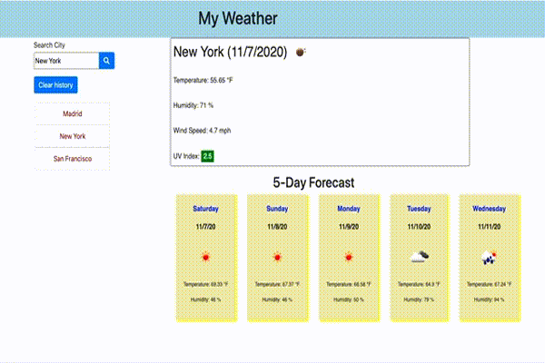

# Introduction
The purpose of the project is to use the [OpenWeather API](https://openweathermap.org/api) to retrieve weather data for cities.
In addition once we have the city information we use `localStorage` to store the cities so we can click on a location to get the updaed weather for that location.

## Table of contents
* [General info](#general-info)
* [Technologies](#technologies)
* [Setup](#setup)
* [User Guide](#user-guide)
* [Credits](#credits)

## General info
The objective is to create a personalized weather portal that allows me to pull the weather for varies cities and store which ones I use regularly.
[My Weather App!](https://ktywelch.github.io/PersonalWeather/)

	
## Technologies
Project is created with:
* Bootstrap version: 4.4.1
* Node JS version: v12.18.4
* Momene JS version 2.29.1
	
## Setup
To run this project, install is a simple download and extraction of the site and access to the internet is required the code relies on bootstrap style sheet and assoicated java scripts.

## User Guide
The weather app will allow a user to search for a city and provide the current weather for the city and show the 5 day forecast.
Based on [World Health Organization's publication ](https://www.who.int/uv/publications/en/UVIGuide.pdf)  the color of the button will adjust based on the value of the UVI.

Application includes the following features: 
* A weather dashboard with form that allows search for a city.
* When selected user is  presented with current and future conditions for that city and that city is added to the search history
* The view of the current weather conditions selected city shows the city name, the date, an icon representation of weather conditions, the temperature, the humidity, the wind speed, and the UV index
* The UV index a color that indicates whether the conditions are favorable, moderate, or severe
* User is also presented future weather conditions for that city in a 5-day forecast that displays the date, an icon representation of weather conditions, the temperature, and the humidity
* If a city in from the search history is selected the current and future conditions for that city are displayed.

## credits
The code used was developed by review the class materials from the UCB boot camp and using javascript and moment.js. Used the fonts and items from the bootstrap 4 samples sample documents. In addition to using resources like StackOverflow, W3Schools and MDN Webdocs. 

Site Validated by https://validator.w3.org/

